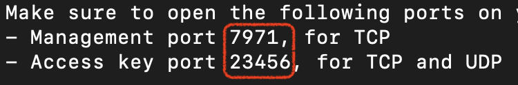
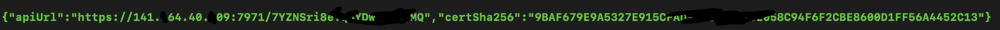
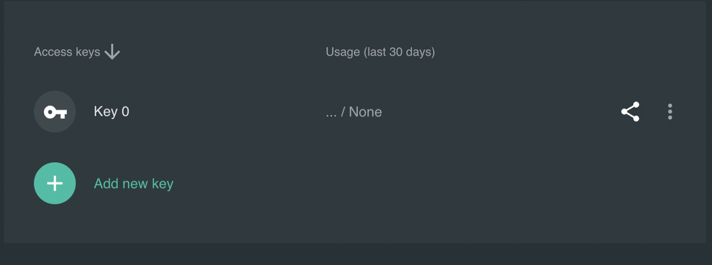

# 科学上网之 Outline 方案

#### 目录

- [1. 购买VPS](#1-购买vps)
  - [1.1. 进入以下或其它地址购买 VPS](#11-进入以下或其它地址购买-vps1)
  - [1.2. 选中并安装 Ubuntu 18.04.6 LTS](#12-选中并安装-ubuntu-18046-lts)
  - [1.3. 打开 22 端口以供ssh登陆用](#13-打开-22-端口以供ssh登陆用)
- [2. 下载 Outline Manager 和 Outline](#2-下载-outline-manager-和-outline)
- [3. 服务端部署](#3-服务端部署)
  - [3.1. 复制指令](#31-复制指令)
  - [3.2. 登陆服务器](#32-登陆服务器)
  - [3.3. 执行部署指令](#33-执行部署指令)
- [4. 客户端配置](#4-客户端配置)
- [5. 引用](#5-引用)

*前言：本文客户端基于英文环境的 macOS Monterey 系统，服务器基于 Ubuntu 18.04.6 LTS。*

## 1. 购买VPS

### 1.1 进入以下或其它地址购买 VPS[^1]

- [AWS LightSail](https://lightsail.aws.amazon.com/)
- [AWS EC2](https://aws.amazon.com/cn/)
- [Google Cloud Platform](https://cloud.google.com/)
- [Linode](https://www.linode.com/)
- [Conoha](https://www.conoha.jp/zh/)
- [Oracle Cloud](https://www.oracle.com/cloud/free/)
- [DigitalOcean](https://www.digitalocean.com/pricing/droplets#basic-droplets)

**注意事项：不要购买 Vultr 的 VPS ，很多人反馈被封锁的 IP 太多。据我自己实测，美国旧金山和洛杉矶、日本、新加坡的机器无法科学上网，只有韩国可以，而且韩国的这个 IP 还被奈飞等一些网站屏蔽。在进入提供商页面注册账号之前可先搜索对应提供商的优惠码或促销链接，通过这些优惠码或促销链接可获得一定的优惠。**

### 1.2 选中并安装 Ubuntu 18.04.6 LTS

### 1.3 打开 22 端口以供ssh登陆用

```Bash
sudo ufw allow 22/tcp
```

## 2. 下载 Outline Manager 和 Outline

官网: https://getoutline.org/zh-CN/get-started/

Github: https://github.com/Jigsaw-Code

## 3. 服务端部署

### 3.1 复制指令

打开 Outline Manager ，点击 ADVANCED 块的 SET UP 按钮，复制 Log into your server, and run this command. 下框中的指令：

```Bash
sudo bash -c “$(wget -qO- https://raw.githubusercontent.com/Jigsaw-Code/outline-server/master/src/server_manager/install_scripts/install_server.sh)"
```

### 3.2 登陆服务器

打开 终端 ，输入指令回车后再输入密码登陆 VPS：

```
语法： ssh <user>@<host> 
示例： ssh root@192.140.14.40.209
```

### 3.3 执行部署指令

- 显示 CONGRATULATIONS! Your Outline server is up and running. 则表示执行成功。

- 开放管理端口和访问端口，Management port 和 Access key port 后面的数字：



```
语法： sudo ufw allow <port1>,<port2>/tcp 
示例： sudo ufw allow 7971,23456/tcp
```

- 复制绿色的字符串粘贴到 Outline Manager 的第二个框即 Paste your installation output here. 下面，并点击 Done 。



- 点击 Key 后面的分享，复制 2) Copy the following access key. 下面的 ss 链接。



## 4. 客户端配置

- 电脑手机等终端打开对应的 Outline 并粘贴 ss 连接即可使用。

- 可以创建多个 Key ，让每一个设备使用一个Key以便于维护和管理。

## 5. 引用
[^1]: GitHub — https://github.com/haoel/haoel.github.io